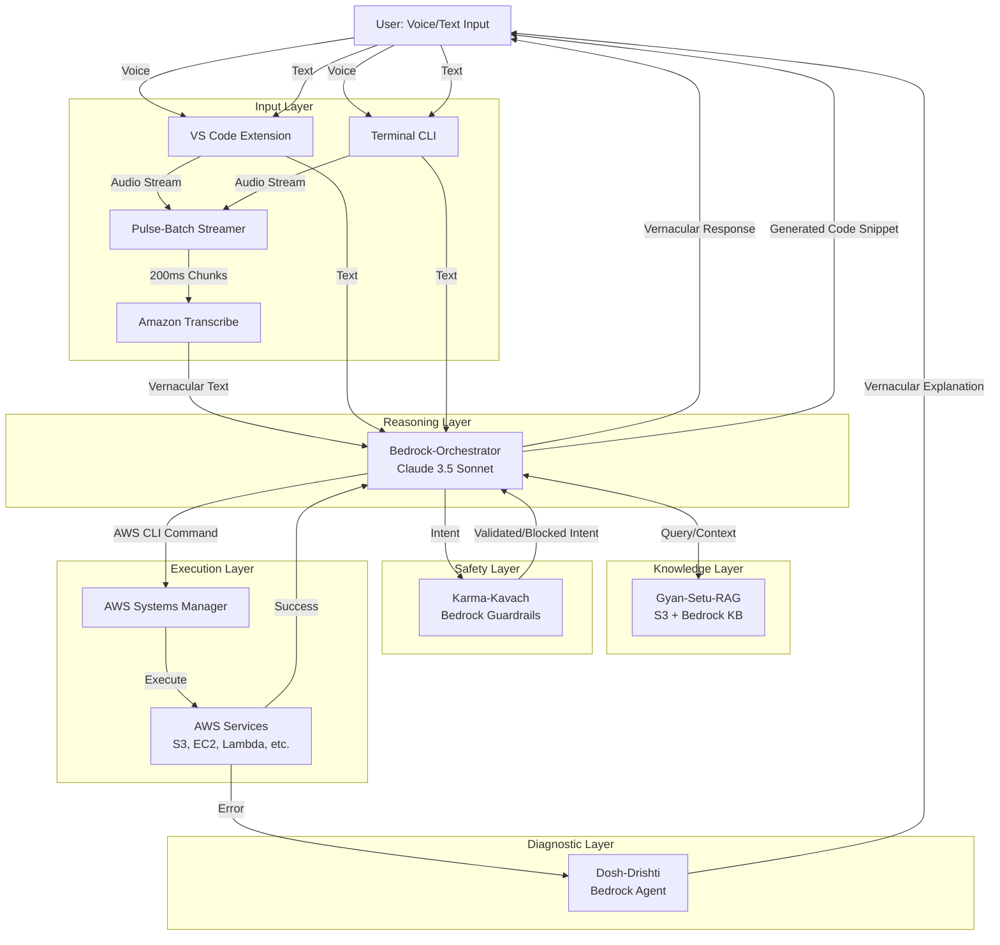

# Design Document: Dev-Sarathi Core

## Overview

Dev-Sarathi Core is a vernacular AI co-pilot system that enables Indian developers to code, interact and build with AWS services using their native languages. The system integrates multiple AWS services (Transcribe, Bedrock, S3, SSM, Guardrails) to provide a seamless voice-to-action pipeline with built-in safety mechanisms and pedagogical error explanations.

The architecture follows a modular pipeline design:
1. **Input Layer** (Vani-Srijan): Captures voice/text input and transcribes to text
2. **Reasoning Layer** (Bedrock-Orchestrator): Interprets intent and generates commands
3. **Knowledge Layer** (Gyan-Setu-RAG): Provides contextual learning and documentation
4. **Safety Layer** (Karma-Kavach): Validates commands before execution
5. **Execution Layer** (AWS-SSM): Executes validated commands securely
6. **Diagnostic Layer** (Dosh-Drishti): Analyzes and explains errors in vernacular

## Architecture

### High-Level Architecture



### Component Interaction Flow

**Learning Query Flow (Gyan-Setu)**:
1. User asks question in vernacular → Orchestrator
2. Orchestrator queries Gyan-Setu-RAG for context
3. RAG retrieves relevant documentation from S3 Knowledge Base
4. Orchestrator synthesizes cultural analogy + technical explanation
5. Response returned in user's vernacular language

**Command Generation and Execution Flow (Vani-Srijan)**:
1. User expresses logic and reasoning in Indian language → Pulse-Batch → Transcribe → Orchestrator
2. Orchestrator interprets intent and generates code/ command
3. Command sent to Karma-Kavach for safety validation
4. If safe: SSM executes command → Result returned in vernacular
5. If unsafe: Warning displayed, override confirmation required

**Error Handling Flow (Dosh-Drishti)**:
1. SSM execution fails with non-zero exit code
2. Error intercepted and routed to Dosh-Drishti
3. Dosh-Drishti analyzes stack trace using Bedrock Agent
4. Pedagogical explanation generated in vernacular
5. Suggested fix provided to user

## Components and Interfaces

### 1. Input Layer Components

#### Pulse-Batch Streamer
**Purpose**: Optimize voice input latency by streaming audio in small chunks

**Interface**:
```typescript
interface PulseBatchStreamer {
  // Start streaming audio from microphone
  startStream(audioSource: AudioSource): StreamHandle
  
  // Stop streaming and finalize
  stopStream(handle: StreamHandle): void
  
  // Configure chunk size (default 200ms)
  setChunkSize(milliseconds: number): void
}

interface AudioSource {
  deviceId: string
  sampleRate: number
  channels: number
}

interface StreamHandle {
  id: string
  status: 'active' | 'paused' | 'stopped'
}
```

**Behavior**:
- Buffers audio in 200ms chunks
- Streams to Amazon Transcribe via WebSocket
- Handles network interruptions gracefully

#### VS Code Extension Interface
**Purpose**: Provide integrated IDE experience

**Interface**:
```typescript
interface DevSarathiExtension {
  // Activate extension panel
  activate(context: ExtensionContext): void
  
  // Handle text input from panel
  handleTextInput(text: string, language: VernacularLanguage): Promise<Response>
  
  // Handle voice input from microphone
  handleVoiceInput(audioStream: AudioStream): Promise<Response>
  
  // Display response in panel
  displayResponse(response: Response): void
}

type VernacularLanguage = 'hindi' | 'kannada' | 'hinglish' | 'kanglish'

interface Response {
  content: string
  language: VernacularLanguage
  citations?: Citation[]
  codeSnippets?: CodeSnippet[]
}
```

#### Terminal CLI Interface
**Purpose**: Provide command-line access for terminal-first developers

**Interface**:
```typescript
interface DevSarathiCLI {
  // Initialize CLI with AWS credentials
  init(config: AWSConfig): void
  
  // Process text command
  processText(command: string): Promise<CLIResponse>
  
  // Process voice command
  processVoice(): Promise<CLIResponse>
  
  // Set preferred language
  setLanguage(lang: VernacularLanguage): void
}

interface CLIResponse {
  success: boolean
  message: string
  output?: string
  error?: ErrorDetails
}
```

### 2. Reasoning Layer Components

#### Bedrock-Orchestrator
**Purpose**: Central reasoning engine that interprets intent and coordinates all operations

**Interface**:
```typescript
interface BedrockOrchestrator {
  // Process user input and determine intent
  processInput(input: UserInput): Promise<Intent>
  
  // Generate code  command from intent
  generateCommand(intent: Intent): Promise<AWSCommand>
  
  // Query knowledge base for learning requests
  queryKnowledgeBase(query: string, language: VernacularLanguage): Promise<KnowledgeResponse>
  
  // Synthesize response in vernacular
  synthesizeResponse(data: any, language: VernacularLanguage): Promise<string>
}

interface UserInput {
  text: string
  language: VernacularLanguage
  context?: ConversationContext
}

interface Intent {
  type: 'learning' | 'command' | 'diagnostic'
  action?: AWSAction
  parameters?: Record<string, any>
  isDestructive: boolean
}

interface AWSCommand {
  service: string
  operation: string
  parameters: Record<string, any>
  cliString: string
}
```

### 3. Knowledge Layer Components

#### Gyan-Setu-RAG
**Purpose**: Retrieve and provide contextual documentation for learning queries

**Interface**:
```typescript
interface GyanSetuRAG {
  // Query knowledge base with semantic search
  query(question: string, language: VernacularLanguage): Promise<KnowledgeResponse>
  
  // Retrieve specific documentation
  getDocumentation(service: string, topic: string): Promise<Documentation>
  
  // Generate cultural analogy
  generateAnalogy(concept: string, language: VernacularLanguage): Promise<Analogy>
}

interface KnowledgeResponse {
  answer: string
  analogy?: Analogy
  citations: Citation[]
  relatedTopics: string[]
}

interface Analogy {
  concept: string
  analogy: string
  explanation: string
  language: VernacularLanguage
}

interface Citation {
  title: string
  url: string
  excerpt: string
}
```

### 4. Safety Layer Components

#### Karma-Kavach (Bedrock Guardrails)
**Purpose**: Validate commands for safety before execution

**Interface**:
```typescript
interface KarmaKavach {
  // Evaluate intent for safety
  evaluateIntent(intent: Intent): Promise<SafetyEvaluation>
  
  // Check if command is destructive
  isDestructive(command: AWSCommand): boolean
  
  // Request override confirmation
  requestOverride(command: AWSCommand, language: VernacularLanguage): Promise<boolean>
}

interface SafetyEvaluation {
  safe: boolean
  reason?: string
  severity: 'low' | 'medium' | 'high' | 'critical'
  requiresOverride: boolean
  warningMessage?: string
}
```

**Destructive Operations**:
- Delete operations (DeleteBucket, DeleteObject, TerminateInstances)
- Purge operations (PurgeQueue, EmptyBucket)
- Terminate operations (TerminateInstances, DeleteStack)
- Modify operations on production resources (UpdateStack, ModifyDBInstance)

### 5. Execution Layer Components

#### AWS-SSM Executor
**Purpose**: Execute validated AWS CLI commands securely

**Interface**:
```typescript
interface AWSSSMExecutor {
  // Execute command via SSM
  executeCommand(command: AWSCommand, target: ExecutionTarget): Promise<ExecutionResult>
  
  // Get command execution status
  getExecutionStatus(executionId: string): Promise<ExecutionStatus>
  
  // Cancel running execution
  cancelExecution(executionId: string): Promise<void>
}

interface ExecutionTarget {
  instanceId?: string
  role: string
  region: string
}

interface ExecutionResult {
  success: boolean
  output: string
  exitCode: number
  executionId: string
  duration: number
}

interface ExecutionStatus {
  status: 'pending' | 'running' | 'success' | 'failed' | 'cancelled'
  output?: string
  error?: string
}
```

### 6. Diagnostic Layer Components

#### Dosh-Drishti (Diagnostic Agent)
**Purpose**: Analyze errors and provide vernacular explanations

**Interface**:
```typescript
interface DoshDrishti {
  // Analyze error and generate explanation
  analyzeError(error: ExecutionError, language: VernacularLanguage): Promise<ErrorExplanation>
  
  // Suggest fix for error
  suggestFix(error: ExecutionError, language: VernacularLanguage): Promise<Fix>
  
  // Generate pedagogical explanation
  explainConcept(errorType: string, language: VernacularLanguage): Promise<string>
}

interface ExecutionError {
  code: string
  message: string
  stackTrace: string
  command: AWSCommand
  exitCode: number
}

interface ErrorExplanation {
  summary: string
  detailedExplanation: string
  rootCause: string
  language: VernacularLanguage
}

interface Fix {
  description: string
  suggestedCommand?: string
  steps: string[]
  preventionTips: string[]
}
```

## Data Models

### User Session
```typescript
interface UserSession {
  sessionId: string
  userId: string
  preferredLanguage: VernacularLanguage
  conversationHistory: Message[]
  awsCredentials: AWSCredentials
  createdAt: Date
  lastActivity: Date
}

interface Message {
  id: string
  role: 'user' | 'assistant'
  content: string
  language: VernacularLanguage
  timestamp: Date
  intent?: Intent
  command?: AWSCommand
}
```

### AWS Credentials
```typescript
interface AWSCredentials {
  type: 'iam-role' | 'profile'
  roleArn?: string
  profileName?: string
  region: string
  sessionToken?: string
  expiresAt?: Date
}
```

### Transcription Result
```typescript
interface TranscriptionResult {
  text: string
  confidence: number
  language: string
  alternatives?: TranscriptionAlternative[]
  duration: number
}

interface TranscriptionAlternative {
  text: string
  confidence: number
}
```

### Knowledge Base Entry
```typescript
interface KnowledgeEntry {
  id: string
  service: string
  topic: string
  content: string
  vernacularTranslations: Record<VernacularLanguage, string>
  analogies: Record<VernacularLanguage, Analogy>
  citations: Citation[]
  lastUpdated: Date
}
```

### Execution Log
```typescript
interface ExecutionLog {
  id: string
  sessionId: string
  command: AWSCommand
  intent: Intent
  safetyEvaluation: SafetyEvaluation
  executionResult: ExecutionResult
  timestamp: Date
  userOverride?: boolean
}
```
